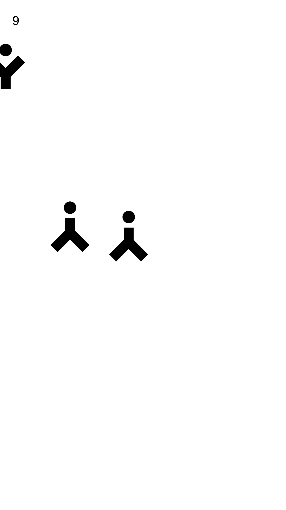
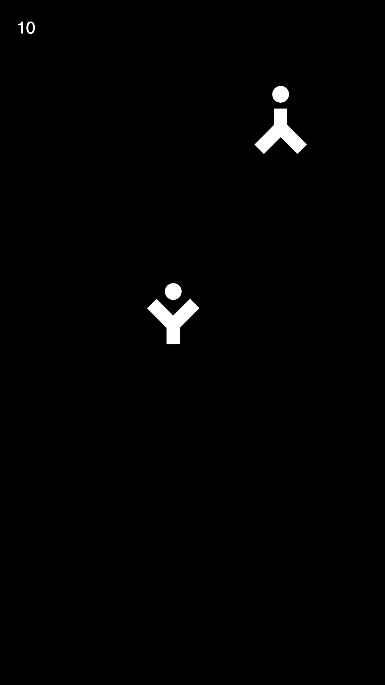

# zfloatin

What is this? Version 1.0.0 of a game or just a graphical browser experience?

### See for yourself
https://matthias-jaeger-net.github.io/zfloatin

### TO DO

- [x] Create running example page
- [x] Change file structure
- [ ] Make physics better
- [ ] Welcome screen
- [x] Images in readme

### Images

